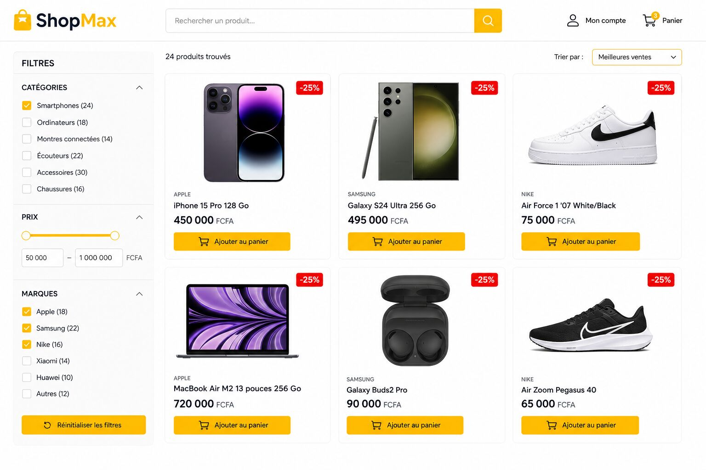
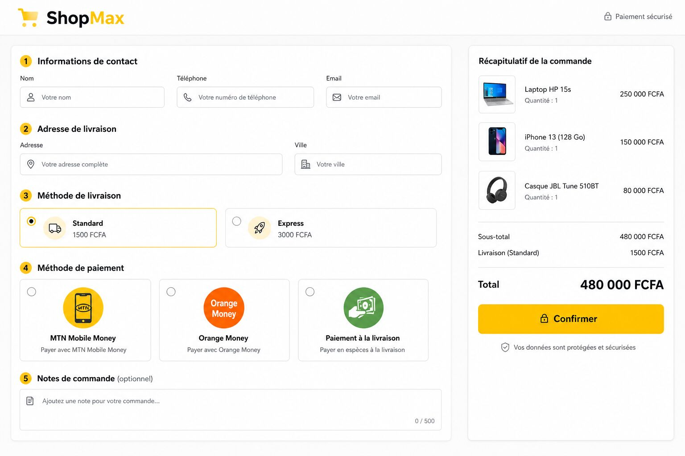
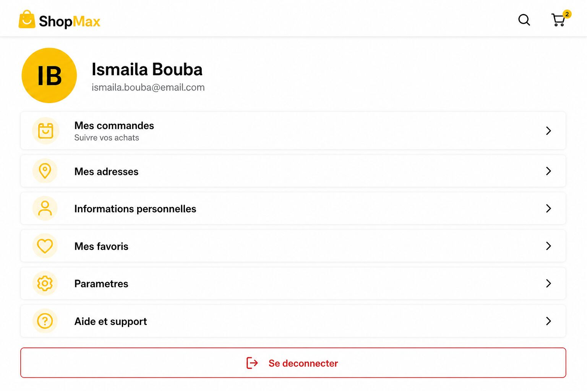
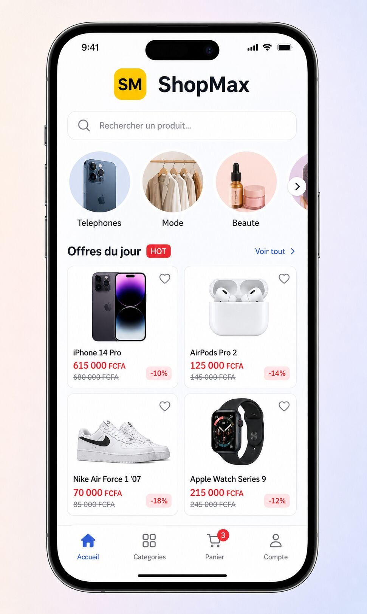

# ShopMax


> **Plateforme e-commerce full-stack pour le marche camerounais**
> Site web (Next.js 15) + App mobile (Flutter) + Backend (ASP.NET Core 10)

[]()
[](LICENSE)
[]()
[]()
[]()
[]()

---

## Demo en ligne

🌐 **Site web** : [https://shopmax.vercel.app](https://shopmax.vercel.app) *(apres deploiement)*
📱 **App mobile** : APK telechargeable *(voir [INSTALLATION.md](INSTALLATION.md))*
💻 **Code source** : [https://github.com/TON_USER/shopmax](https://github.com/TON_USER/shopmax)

## Apercu visuel

### Page d'accueil


### Liste des produits


### Detail produit


### Panier


### Checkout


### Compte client


### App mobile Flutter


## Stack technique

### Frontend Web (Next.js 15)
- **Next.js 15** avec App Router, RSC, Server Actions
- **React 19** + **TypeScript 5**
- **Tailwind CSS 3** + **Shadcn/UI** (40+ composants)
- **Framer Motion** (animations)
- **PWA** (manifest, service worker, offline page)
- **next-themes** (mode sombre/clair)
- **Form Builder** + **Zod** (validation)

### Backend API (ASP.NET Core 10)
- **ASP.NET Core 10** (C# 13)
- **Entity Framework Core** (ORM)
- **PostgreSQL 15** (BDD relationnelle)
- **Redis** (cache + sessions)
- **JWT** (authentification stateless)
- **OAuth 2.0** (Google, Facebook)
- **Swagger/OpenAPI** (documentation auto)
- **Resend** (emails transactionnels)
- **NotchPay** (paiement Mobile Money)

### App Mobile (Flutter 3.16)
- **Flutter 3.16+** (Dart 3)
- **Riverpod 2** (state management)
- **go_router 14** (navigation)
- **Dio 5** (HTTP client)
- **Google Fonts** + **Shimmer** + **Cached Network Image**
- **SharedPreferences** (stockage local)

## Fonctionnalites

### Cote client
- [x] Catalogue produits avec recherche avancee
- [x] Detail produit avec galerie, avis, stock
- [x] Panier persistant (local + serveur)
- [x] Checkout complet (adresse, livraison, paiement)
- [x] Suivi de commande en temps reel
- [x] Compte client (commandes, adresses, profil, favoris)
- [x] Wishlist / favoris
- [x] Mode sombre/clair
- [x] PWA installable (mobile + desktop)
- [x] Mode hors-ligne
- [x] Recherche avec autocompletion

### Cote paiement
- [x] MTN Mobile Money
- [x] Orange Money
- [x] Paiement a la livraison
- [x] Visa / Mastercard (via NotchPay)

### Authentification
- [x] Email / mot de passe (BCrypt + JWT)
- [x] OAuth Google (bientot)
- [x] OAuth Facebook

## Architecture

```
shopmax/
├── frontend/          # Next.js 15 (29 pages + PWA)
├── backend/           # ASP.NET Core 10 API
├── shopmax_flutter/   # App mobile Flutter (16 ecrans)
├── screenshots/       # Captures d'ecran pour portfolio
├── *.bat              # Scripts Windows
└── *.md               # Documentation
```

```
+----------------+      +-------------------+      +----------------+
|   Frontend     |      |    Backend API    |      |   PostgreSQL   |
|   Next.js 15   | <--> |   ASP.NET 10      | <--> |   Database     |
|   Port 3000    |      |   Port 5000       |      |   Port 5432    |
+----------------+      +-------------------+      +----------------+
        |                        |
        v                        v
+----------------+      +----------------+
|  Flutter App   |      |     Redis      |
|  (Mobile)      |      |   (Cache)      |
+----------------+      +----------------+
```

## Demarrage rapide

### Prerequis
- **Node.js 20+**
- **.NET SDK 10+**
- **PostgreSQL 15+**
- **Flutter 3.16+** (optionnel, pour l'app mobile)
- **Git**

### Installation (5 min)

#### 1. Cloner le projet
```bash
git clone https://github.com/TON_USER/shopmax.git
cd shopmax
```

#### 2. Backend
```bash
cd backend
cp .env.example .env
# Edite .env avec tes valeurs

dotnet restore
dotnet ef database update
dotnet run
```
> Backend sur `http://localhost:5000`

#### 3. Frontend
```bash
cd ../frontend
cp .env.example .env.local
npm install
npm run dev
```
> Frontend sur `http://localhost:3000`

#### 4. App mobile (optionnel)
```bash
cd ../shopmax_flutter
flutter pub get
flutter run
```

## Scripts Windows (.bat)

Le projet inclut **20+ scripts .bat** prets a l'emploi :

| Script | Description |
|--------|-------------|
| `shopmax.bat` | Menu principal interactif |
| `setup-github.bat` | **Config GitHub (une fois)** |
| `publish-github.bat` | **Push sur GitHub (a chaque update)** |
| `install.bat` | Installation des dependances |
| `start-dev.bat` | Lance backend + frontend |
| `test.bat` | Lance les tests |
| `build.bat` | Build de production |
| `migrate-simple.bat` | Migration BDD |
| `setup-env.bat` | Configuration environnement |

Voir [MODE-EMPLOI-WINDOWS.md](MODE-EMPLOI-WINDOWS.md) pour le detail.

## Tests

| Type | Framework | Quantite | Status |
|------|-----------|----------|--------|
| Backend C# | xUnit | ~50 | ✅ Tous passants |
| Frontend TS | Vitest | ~80 | ✅ Tous passants |
| Flutter | flutter test | 18 | ✅ Tous passants |
| **Total** | - | **~150** | **OK** |

```bash
# Lancer tous les tests
test.bat
```

## Deploiement

### Frontend (Vercel - recommande)
1. Push le code sur GitHub (cf. `setup-github.bat` + `publish-github.bat`)
2. Va sur https://vercel.com
3. Sign in with GitHub
4. Import le projet `shopmax`
5. Root Directory : `frontend`
6. Deploy !

> URL generee : `https://shopmax.vercel.app`

### Backend (Railway)
1. Va sur https://railway.app
2. New Project > Deploy from GitHub
3. Selectionne `shopmax`
4. Ajoute PostgreSQL et Redis
5. Configure les variables d'environnement
6. Deploy !

Voir [GUIDE-DEPLOIEMENT.md](GUIDE-DEPLOIEMENT.md) pour plus de details.

## Documentation

- [START-HERE.md](START-HERE.md) - Demarrage rapide scripts .bat
- [GITHUB-SETUP.md](GITHUB-SETUP.md) - Publication GitHub pas-a-pas
- [GUIDE-DEPLOIEMENT.md](GUIDE-DEPLOIEMENT.md) - Vercel vs GitHub Pages vs Railway
- [MODE-EMPLOI-WINDOWS.md](MODE-EMPLOI-WINDOWS.md) - Guide Windows
- [SCRIPTS-BAT.md](SCRIPTS-BAT.md) - Detail des scripts
- [GUIDE-GOOGLE-OAUTH.md](GUIDE-GOOGLE-OAUTH.md) - Config Google OAuth

## Roadmap

### v1.1 (Q4 2025)
- [ ] Re-activer Google OAuth
- [ ] Dashboard admin complet
- [ ] Systeme d'avis avec photos
- [ ] Notifications push (Firebase)

### v1.2 (Q1 2026)
- [ ] Mode multi-vendeurs
- [ ] Integration livraison (track GPS)
- [ ] Programme de fidelite / cashback
- [ ] Recherche vocale

### v2.0 (Q2 2026)
- [ ] IA de recommandation produits
- [ ] App native iOS optimisee
- [ ] Integration crypto (USDC)
- [ ] Live shopping

## Contribution

Les PR sont les bienvenues !

1. Fork le projet
2. Cree une branche (`git checkout -b feature/AmazingFeature`)
3. Commit (`git commit -m 'Add AmazingFeature'`)
4. Push (`git push origin feature/AmazingFeature`)
5. Ouvre une Pull Request

## Licence

Distribue sous la licence MIT. Voir [LICENSE](LICENSE) pour plus de details.

## Auteur

**Ismaila Bouba**
- 🎓 Developpeur Full-Stack
- 📍 Yaounde, Cameroun
- 💼 Portfolio : [https://github.com/TON_USER](https://github.com/TON_USER)
- 📧 Email : ismailabouba001@gmail.com
- 💼 LinkedIn : [linkedin.com/in/TON_USER](https://linkedin.com/in/TON_USER)

## Remerciements

- L'equipe Next.js / Vercel pour le framework incroyable
- La communaute .NET pour les outils
- L'equipe Flutter pour le SDK mobile
- Tous les contributeurs open-source qui ont rendu ce projet possible

---

⭐ **Si ce projet t'a aide, mets-lui une etoile sur GitHub !**


